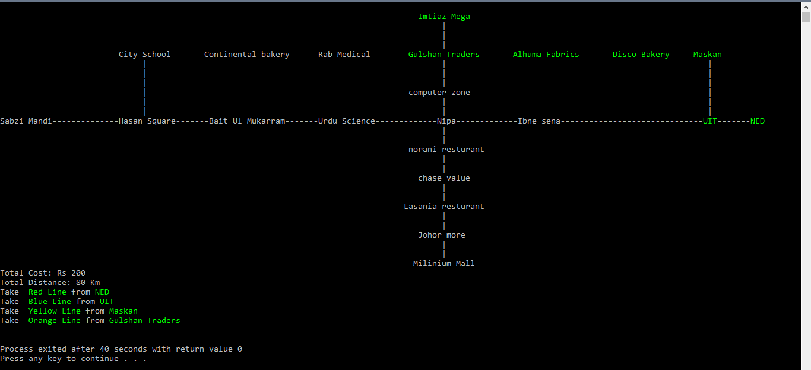
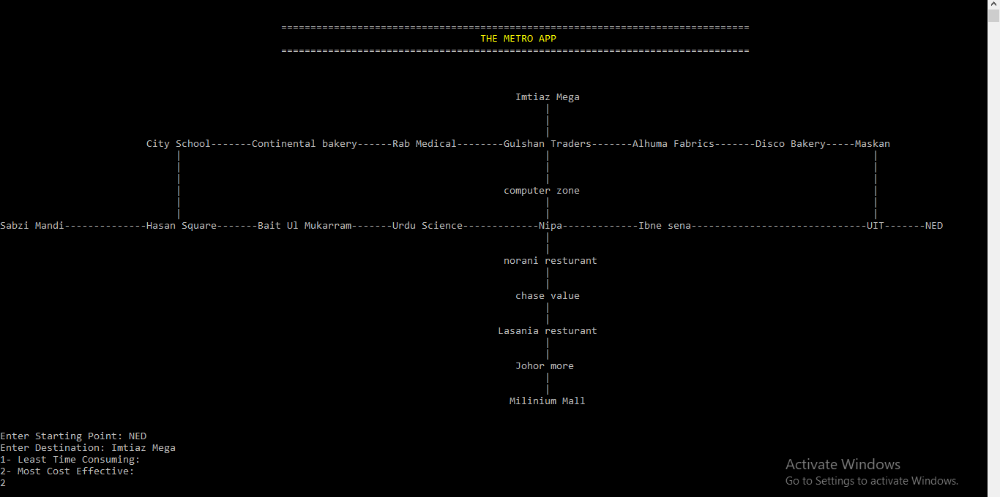
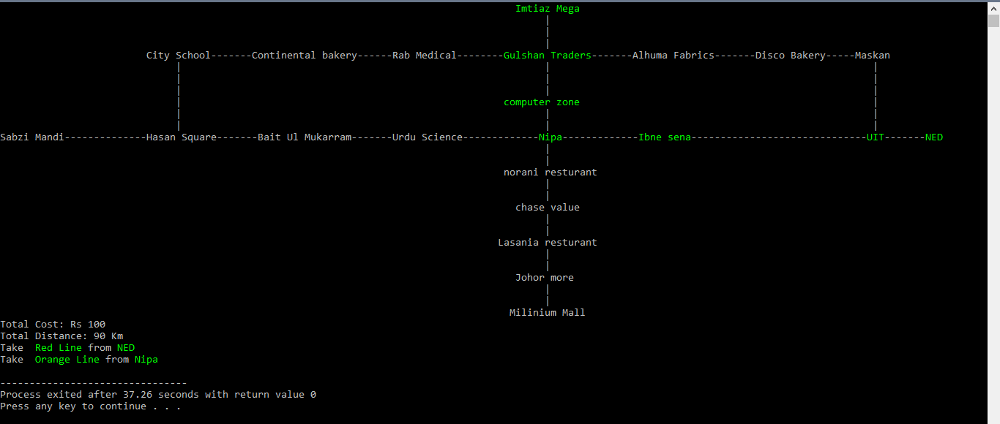

<a name="readme-top"></a>

# The Metro App

<!-- TABLE OF CONTENTS -->
<details>
  <summary>Table of Contents</summary>
  <ol>
    <li><a href="#about-the-project">About The Project</a></li>
    <li><a href="#built-with">Built With</a></li>
    <li><a href="#prerequisites">Prerequisites</a></li>
    <li><a href="#installation">Installation</a></li>
    <li><a href="#demo">Demo</a></li>
    <li><a href="#contact">Contact</a></li>
  </ol>
</details>


<!-- ABOUT THE PROJECT -->
## About The Project
Introducing the Metro Navigator App: A Smart Travel Solution

Embark on a seamless journey with our Metro Navigator App, a meticulously crafted project in C++ that leverages graph data structures to revolutionize the way travelers navigate through the city. This innovative application serves the dual purpose of optimizing travel time and minimizing costs for users, ensuring a hassle-free commuting experience.

<b>Key Features: </b>

* <b>Optimal Time Route Selection:</b>
Utilizing Dijkstra's algorithm, our Metro Navigator App empowers users to choose the fastest route to their destination. By intelligently analyzing the graph representation of the metro system, the app provides real-time recommendations on the most time-efficient buses to take. This feature is a game-changer for commuters who prioritize reaching their destinations promptly.

* <b>Cost-Effective Journey Planning:</b>
Going beyond speed, our app also addresses the economic aspect of travel. Employing a brute force approach, the Metro Navigator App assists users in identifying bus routes that lead to their destination at the lowest cost. This functionality is particularly beneficial for budget-conscious travelers, ensuring that they make financially prudent decisions while exploring the city.

<b>How It Works:</b>

* <b>User-Friendly Interface:</b>
The Metro Navigator App boasts an intuitive and user-friendly interface, making it accessible to a wide range of users. Simply input your current location and desired destination, and let the app handle the rest.

* <b>Graph Representation:</b>
The underlying data structure is a graph that accurately reflects the intricate network of bus routes within the metro system. This ensures that the app's recommendations are not only efficient but also grounded in the geographical reality of the city.

In conclusion, the Metro Navigator App is not just a navigation tool; it's a comprehensive solution designed to enhance the overall travel experience. Whether you prioritize time efficiency or cost-effectiveness, this C++ project stands at the forefront of smart, data-driven travel solutions.

<p align="right">(<a href="#readme-top">back to top</a>)</p>


### Built With

[![C++][cpp_shield]][C++]

<p align="right">(<a href="#readme-top">back to top</a>)</p>

### Prerequisites


Any C++17 compiler (default g++)
* For Debian-based distros
  ```sh
  apt install g++
  ```
* For RPM-based distros
  ```sh
  yum install gcc-c++
  ```

### Installation

1. Clone the repo
   ```sh
   git clone https://github.com/hassaangatta/The_Metro_App/tree/main.git
   ```
2. Compile the cpp file
   ```sh
   g++ The_Metro_App.cpp -o app
   ```
3. Run the code
   ```sh
   ./app
   ```

<p align="right">(<a href="#readme-top">back to top</a>)</p>

### Demo

The App will ask you to enter your starting point and destination, then it will ask your preference whether you want the least time-consuming path (shortest path) or the least cost path</br>

<div align="center">
  
</div>
<div align="center">
  
</div>
<div align="center">
  
</div>
<div align="center">
  
</div>

In both cases, we have taken the same source and destination and you can clearly see the difference in both.

<p align="right">(<a href="#readme-top">back to top</a>)</p>


<!-- CONTACT -->
## Contact

Hassaan Gatta - hassaangatta@gmail.com

Project Link: [https://github.com/hassaangatta/The_Metro_App/tree/main](https://github.com/hassaangatta/The_Metro_App/tree/main)

<p align="right">(<a href="#readme-top">back to top</a>)</p>


[C++]: https://isocpp.org/
[cpp_shield]: https://img.shields.io/badge/-c++-black?logo=c%2B%2B&style=social
